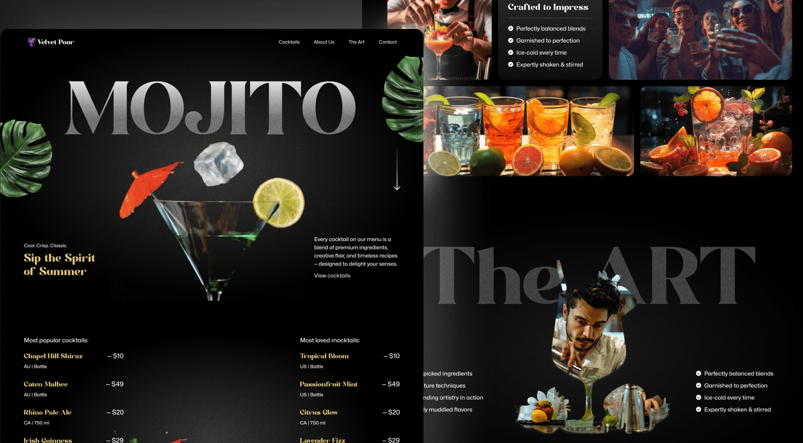

# Landing Page Animada com GSAP

<p align="center">
  
</p>

[]()
[]()
[]()

---
## 💡 Descrição

Este é um projeto de **landing page animada**, criado com o objetivo de colocar em prática os conceitos aprendidos durante o curso de GSAP. O foco é entregar uma experiência visual fluida, com animações suaves de entrada, interações ao rolar (scroll) e atenção especial para responsividade.  

Alguns diferenciais:

- Uso de **GSAP** para animações de alto desempenho.  
- Organização de código clara, separando os componentes visuais, estilos e scripts.  
- Layout responsivo, para funcionar bem em diferentes tamanhos de tela.  
- Melhora na percepção de usabilidade com animações bem aplicadas, sem exagero.
---
## 📸 Demonstração

<p align="center">


</p>

---

## 🚀 Recursos Principais

- Animações de entrada. 
- Scroll animations: elementos que aparecem ou se transformam conforme o usuário rola a página.  
- Transições suaves entre seções.  
- Layout responsivo adaptado para mobile / tablet / desktop.  
- Uso de GSAP para controle de timeline, easings, transformações.  
- Estrutura de pastas organizada: separação de constantes, assets, scripts, estilos, etc.

---

## 🔧 Visualizar localmente

Mesmo que não haja necessidade de instalação pesada, aqui vai um passo a passo pra quem quiser ver o projeto no próprio computador:

```bash
# Clone este repositório
git clone https://github.com/Leandro-Kolosque/gsap_landing.git

# Acesse a pasta do projeto
cd gsap_landing

# Abra o index.html no navegador
# (pode ser diretamente ou via servidor local, se quiser observar requisições, live reload etc.)
```

## 🤝 Contribuição & Feedback

Contribuições são bem-vindas! Se você tiver sugestão de melhoria, correção de bugs, nova animação ou sugestão de layout, sinta-se à vontade para:

- Abrir uma *issue* aqui no repositório.  
- Enviar um *pull request* explicando detalhadamente o que fez.  

Também ficarei feliz com feedback — se achar que algo pode ser mais performático ou melhor visualmente, me chame; é sempre um aprendizado.

---

## 📬 Contato

**Leandro Kolosque**  
[GitHub](https://github.com/Leandro-Kolosque) <br>
[LinkedIn](https://www.linkedin.com/in/Leandro-Kolosque/)  <br>
[Email](mailto:leandro.wingerth@gmail.com)  <br>

---

## 🙏 Agradecimentos

Este projeto foi desenvolvido com base no curso de **GSAP** disponibilizado pelo **[JS Mastery](https://www.jsmastery.pro/)**.  
Agradeço ao instrutor e à comunidade pelo conteúdo de qualidade que tornou este aprendizado possível.


## 📄 Licença

Esse projeto está licenciado sob a **MIT License** — você pode ver mais no arquivo [LICENSE](./LICENSE).
